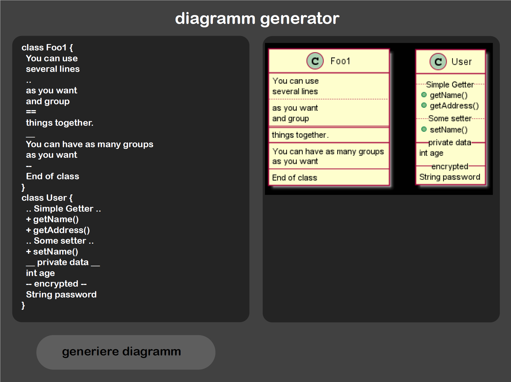

= Projektauftrag
Moritz Eder, Abdulrahman Al Sabagh, Angerer Mona
1.0.0, 2021/22
ifndef::imagesdir[:imagesdir: images]
//:toc-placement!:  // prevents the generation of the doc at this position, so it can be printed afterwards
:sourcedir: ../src/main/java
:icons: font
:sectnums:    // Nummerierung der Überschriften / section numbering
:toc: left

//Need this blank line after ifdef, don't know why...
ifdef::backend-html5[]

// print the toc here (not at the default position)
//toc::[]

== Projektbezeichnung

Diagramm Generator

== Projektauftraggeber

Prof. Mag. Dr. Thomas Stütz

== Projekthintergrund

Wir als HTL Schüler müssen oft Diagramme für verschiedene Übungen oder Programme zeichen. Durch diesen Generator wird das Erstellen solcher Diagramme sehr viel einfacher werden. Der Generator würde auch dazu dienen, dass man Java Programme dadurch besser verstehen kann.

== Projektendergebnis

Ein vollständiger Diagrammgenerator wird bis spätestens Ende des Schuljahres fertig sein. Es wird also ein Projekt zu Forward oder Reverse Engineering. Kriterien für das Ergebnis könnten sein:

. Funktioniert das Generieren?
. Wurde der Programmcode effizient geschrieben?
. Ist die Ausgabe gut leserlich gestaltet?
. Ist es benutzerfreundlich?

Dieses Design wurde bereits entworfen:

== Projektziel

Das Ziel dieses Projektes wird ein fertiger Diagrammgenerator sein, den Schüler für das Erstellen von Diagrammen nutzen können, damit es nicht mehr so umständlich ist. Es sollte also einfach ein praktischer und schneller Weg sein, Diagramme für Java zu erstellen.

== Projektbeschreibung

Das Projekt würde circa so aussehen: Es gibt es einen Knopf, der der Auslöser für das Generieren des Diagramms ist. Wenn man also mit einem Programm oder einer Übung in Java fertig ist, klickt man auf diesen Knopf und dann wird ein Diagramm generiert, das so wie ein Diagramm von PlantUML aussehen würde. Das Design wird übersichtlich und lesbar gestaltet sein.

== Meilensteine

|=======================
|Meilenstein/Ergebnis|Datum
|Eine Klasse mit Variablen und Methoden kann generiert werden|
|Ein ganzes Projekt kann generiert werden|
|Performance des Programms verbessern|
|=======================

== Projektressourcen

* IntelliJ IDEA
* Java, JavaFX, SceneBuider, Java I/O, JUnit
* Maven
* Docker
* Github

== Projektrisiken

Es könnte sein, dass die Diagramme unübersichtlich gestaltet werden, wenn sehr viele Klassen in einem Projekt vorkommen.
Es könnte dadurch auch zu Performance Problemen kommen, wodurch das Generieren sehr lange brauchen würde.

== Projektorganisation

Projektleiter: Moritz Eder: zuständig für die Kontrolle des Projektes, das Testen des Programms und die Dokumentation der einzelnen Schritte

Projektteam: +
Abdulrahman Al Sabagh: zuständig für Logik des Java Programms +
Mona Angerer: zuständig für Design

== Abschluss des Projektauftrags

18.11.2021

